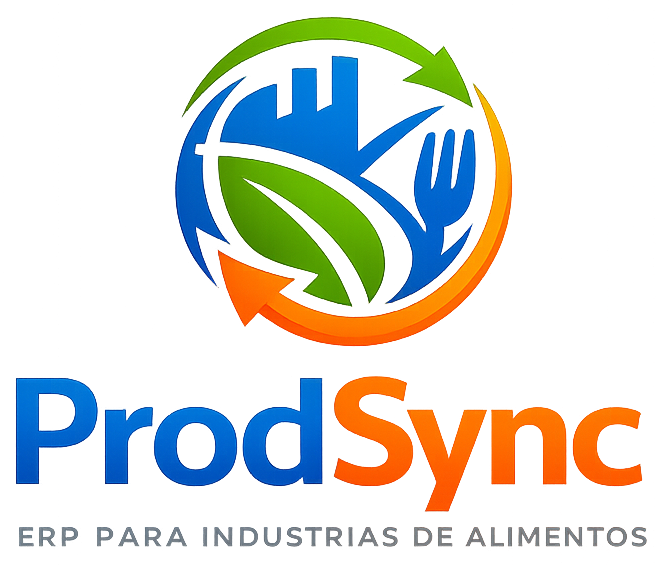

# 💻 Helbert Miranda

**Sejam bem-vindos ao meu perfil!**

> "Talk is cheap. Show me the code." – Linus Torvalds 💬
> “Talk is cheap. Show me what the AI can build.” – GPT Codex 🌐

Desenvolvedor de software com atuação em soluções digitais voltadas à eficiência operacional, automação de processos e inteligência de dados. Minha base profissional no setor produtivo fortalece a construção de sistemas alinhados às necessidades reais do negócio. Trabalho com desenvolvimento full stack, com foco em arquitetura de sistemas, integração de dados e criação de plataformas que apoiem decisões estratégicas e operacionais. Este GitHub reúne projetos, estudos e implementações práticas que refletem minha evolução contínua na área de tecnologia.

> Software developer specializing in digital solutions focused on operational efficiency, process automation, and data intelligence. My professional background in the manufacturing sector strengthens my ability to build systems aligned with real business needs. I work with full-stack development, focusing on systems architecture, data integration, and the creation of platforms that support strategic and operational decisions. This GitHub repository showcases projects, studies, and practical implementations that reflect my continuous evolution in the technology field.

---

##  Linguagens e Tecnologias

 

---

## 🔐 Projetos privados

| Projeto                                                                   | Descrição                                                                                                                                                                                                                                                                           | Linguagem               | Frameworks          | Status                |
| ------------------------------------------------------------------------- | ----------------------------------------------------------------------------------------------------------------------------------------------------------------------------------------------------------------------------------------------------------------------------------- | ----------------------- | ------------------- | --------------------- |
|          | Sistema integrado de gestão industrial voltado à sincronização e otimização das operações de fábrica, com foco em eficiência, controle de processos e tomada de decisão. Acesso: https://prodsync.com.br                                                                            | JavaScript / TypeScript | Next.js / NestJS    | 🚧 Em desenvolvimento |
|  | Aplicativo mobile com funcionalidades inteligentes para organização, visualização e acompanhamento de informações relacionadas ao universo da Nutrição.                                                                                                                             | JavaScript              | React Native / Expo | 🚧 Em desenvolvimento |
|    | Sistema integrado ESG para logística, focado na mensuração e gestão de emissões de GEE, com rastreabilidade, otimização de rotas e apoio à redução e compensação de carbono, alinhado ao GHG Protocol. | JavaScript / TypeScript | Next.js / NestJS    | 🚧 Em desenvolvimento |
